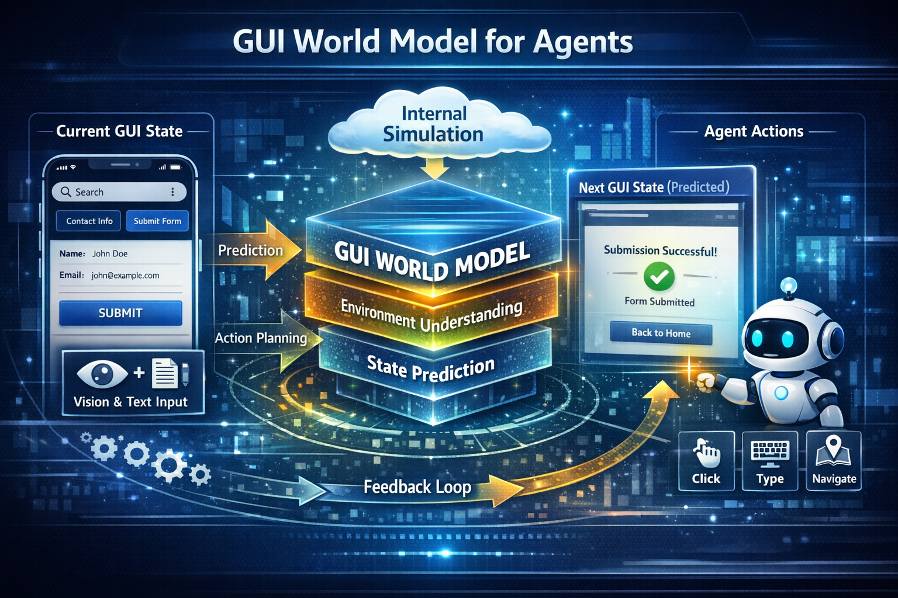

# Awesome GUI World Model 

A curated list of papers, datasets, benchmarks, and resources strictly focused on **GUI World Models** and **Environment Simulators** for autonomous agents.

  

> **Why this Repo?**
>
> While [Awesome-GUI-Agent](https://github.com/showlab/Awesome-GUI-Agent) focuses on the **Agent (The Brain)**, this repository focuses on the **World Model (The Imagination/Environment)**.
>
> To build truly capable GUI Agents, we need **World Models** to enable:
> *   🧠 **Mental Simulation:** Simulate outcomes and verify plans before real execution.
> *   🛡️ **Safe Exploration:** Train agents in a sandbox without deleting your bank account.
> *   ♾️ **Data Synthesis:** Generate infinite training trajectories for rare scenarios.

## 📝 Table of Contents

- [Papers](#-papers)
- [Environments & Benchmarks](#-environments--benchmarks)
- [Datasets](#-datasets)
- [Contributing](#-contributing)

## 📚 Papers

- [Computer-Using World Model](https://arxiv.org/abs/2602.17365) (2026-02)
- [WebWorld: A Large-Scale World Model for Web Agent Training](https://arxiv.org/abs/2602.14721) (2026-02)
- [Code2World: A GUI World Model via Renderable Code Generation](https://arxiv.org/abs/2602.09856) (2026-02) [[Code](https://github.com/AMAP-ML/Code2World)]
- [MobileDreamer: Generative Sketch World Model for GUI Agent](https://arxiv.org/abs/2601.04035) (2026-01)
- [MobileWorldBench: Towards Semantic World Modeling For Mobile Agents](https://arxiv.org/abs/2512.14014) (2025-12) [[Code](https://github.com/jacklishufan/MobileWorld)]
- [Computer-Use Agents as Judges for Generative User Interface](https://arxiv.org/abs/2511.15567) (2025-11) [[Code](https://github.com/showlab/AUI)]
- [LLMs as Scalable, General-Purpose Simulators For Evolving Digital Agent Training](https://arxiv.org/abs/2510.14969) (2025-10) [[Code](https://github.com/WadeYin9712/UI-Simulator)]
- [UISim: An Interactive Image-Based UI Simulator for Dynamic Mobile Environments](https://arxiv.org/abs/2509.21733) (2025-09)
- [NeuralOS: Towards Simulating Operating Systems via Neural Generative Models](https://arxiv.org/abs/2507.08800) (2025-07) [[Code](https://github.com/yuntian-group/neural-os)]
- [WebSynthesis: World-Model-Guided MCTS for Efficient WebUI-Trajectory Synthesis](https://arxiv.org/abs/2507.04370) (2025-07) [[Code](https://github.com/LucusFigoGao/WebSynthesis)]
- [ViMo: A Generative Visual GUI World Model for App Agents](https://arxiv.org/abs/2504.13936) (2025-04) [[Code](https://github.com/ai-agents-2030/ViMo)]
- [WebEvolver: Enhancing Web Agent Self-Improvement with Coevolving World Model](https://arxiv.org/abs/2504.21024) (2025-04) [[Code](https://github.com/Tencent/SelfEvolvingAgent)]
- [Is Your LLM Secretly a World Model of the Internet? Model-Based Planning for Web Agents](https://arxiv.org/abs/2411.06559) (2024-11) [[Code](https://github.com/OSU-NLP-Group/WebDreamer)]
- [Web Agents with World Models: Learning and Leveraging Environment Dynamics](https://arxiv.org/abs/2410.13232) (2024-10) [[Code](https://github.com/kyle8581/WMA-Agents)]
- [Boosting GUI Prototyping with Diffusion Models](https://arxiv.org/abs/2306.06233) (2023-06)

## 🌍 Environments & Benchmarks

## 💾 Datasets

## 🤝 Contributing

Contributions are welcome! Please help keep this list up-to-date.

- **Format:** `[Title](Link) (YYYY-MM) [[Code](Link)]`
- **Sort:** Reverse chronological order (newest at the top).

Just open a Pull Request or an Issue!
