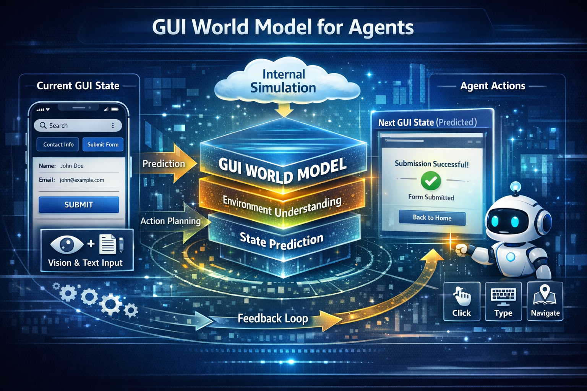

# Awesome GUI World Model 

A curated list of papers, datasets, benchmarks, and resources strictly focused on **GUI World Models** and **Environment Simulators** for autonomous agents.

  

> **Why this Repo?**
>
> While [Awesome-GUI-Agent](https://github.com/showlab/Awesome-GUI-Agent) focuses on the **Agent (The Brain)**, this repository focuses on the **World Model (The Imagination/Environment)**.
>
> To build truly capable GUI Agents, we need **World Models** to enable:
> *   🧠 **Mental Simulation:** Simulate outcomes and verify plans before real execution.
> *   🛡️ **Safe Exploration:** Train agents in a sandbox without deleting your bank account.
> *   ♾️ **Data Synthesis:** Generate infinite training trajectories for rare scenarios.

## 📝 Table of Contents

- [Papers](#-papers)
- [Environments & Benchmarks](#-environments--benchmarks)
- [Datasets](#-datasets)
- [Related Resources](#-related-resources)
- [Contributing](#-contributing)

## 📚 Papers

- [UI-Oceanus: Scaling GUI Agents with Synthetic Environmental Dynamics](https://arxiv.org/abs/2604.02345) (2026-04)
- [Safe and Scalable Web Agent Learning via Recreated Websites](https://arxiv.org/abs/2603.10505) (2026-03) [[Code](https://github.com/kyle8581/VeriEnv)]
- [HATS: Hardness-Aware Trajectory Synthesis for GUI Agents](https://arxiv.org/abs/2603.12138) (2026-03)
- [WorldGUI: An Interactive Benchmark for Desktop GUI Automation from Any Starting Point](https://arxiv.org/abs/2502.08047) (2026-02) [[Code](https://github.com/showlab/WorldGUI)]
- [GEBench: Benchmarking Image Generation Models as GUI Environments](https://arxiv.org/abs/2602.09007) (2026-02) [[Code](https://github.com/stepfun-ai/GEBench)]
- [AutoWebWorld: Synthesizing Infinite Verifiable Web Environments via Finite State Machines](https://arxiv.org/abs/2602.14296) (2026-02)
- [GUI-GENESIS: Automated Synthesis of Efficient Environments with Verifiable Rewards for GUI Agent Post-Training](https://arxiv.org/abs/2602.14093) (2026-02)
- [World-Model-Augmented Web Agents with Action Correction](https://arxiv.org/abs/2602.15384) (2026-02)
- [SafePred: A Predictive Guardrail for Computer-Using Agents via World Models](https://arxiv.org/abs/2602.01725) (2026-02) [[Code](https://github.com/YurunChen/SafePred)]
- [Computer-Using World Model](https://arxiv.org/abs/2602.17365) (2026-02)
- [WebWorld: A Large-Scale World Model for Web Agent Training](https://arxiv.org/abs/2602.14721) (2026-02)
- [Code2World: A GUI World Model via Renderable Code Generation](https://arxiv.org/abs/2602.09856) (2026-02) [[Code](https://github.com/AMAP-ML/Code2World)]
- [GEBench: Benchmarking Image Generation Models as GUI Environments](https://arxiv.org/abs/2602.09007) (2026-02) [[Code](https://github.com/stepfun-ai/GEBench)]
- [Generative Visual Code Mobile World Models](https://arxiv.org/abs/2602.01576) (2026-02) [[Code](https://github.com/trillion-labs/gWorld)]
- [MirrorGuard: Toward Secure Computer-Use Agents via Simulation-to-Real Reasoning Correction](https://arxiv.org/abs/2601.12822) (2026-01)
- [InfiniteWeb: Scalable Web Environment Synthesis for GUI Agent Training](https://arxiv.org/abs/2601.04126) (2026-01)
- [MobileDreamer: Generative Sketch World Model for GUI Agent](https://arxiv.org/abs/2601.04035) (2026-01)
- [DynaWeb: Model-Based Reinforcement Learning of Web Agents](https://arxiv.org/abs/2601.22149) (2026-01)
- [WoW-bench: World of Workflows: A Benchmark for Bringing World Models to Enterprise Systems](https://arxiv.org/abs/2601.22130) (2026-01)
- [GUI Exploration Lab: Enhancing Screen Navigation in Agents via Multi-Turn Reinforcement Learning](https://arxiv.org/abs/2512.02423) (2025-12)
- [MobileWorldBench: Towards Semantic World Modeling For Mobile Agents](https://arxiv.org/abs/2512.14014) (2025-12) [[Code](https://github.com/jacklishufan/MobileWorld)]
- [Web World Models](https://arxiv.org/abs/2512.23676) (2025-12) [[Code](https://github.com/Princeton-AI2-Lab/Web-World-Models)]
- [Computer-Use Agents as Judges for Generative User Interface](https://arxiv.org/abs/2511.15567) (2025-11) [[Code](https://github.com/showlab/AUI)]
- [LLMs as Scalable, General-Purpose Simulators For Evolving Digital Agent Training](https://arxiv.org/abs/2510.14969) (2025-10) [[Code](https://github.com/WadeYin9712/UI-Simulator)]
- [UISim: An Interactive Image-Based UI Simulator for Dynamic Mobile Environments](https://arxiv.org/abs/2509.21733) (2025-09)
- [NeuralOS: Towards Simulating Operating Systems via Neural Generative Models](https://arxiv.org/abs/2507.08800) (2025-07) [[Code](https://github.com/yuntian-group/neural-os)]
- [WebSynthesis: World-Model-Guided MCTS for Efficient WebUI-Trajectory Synthesis](https://arxiv.org/abs/2507.04370) (2025-07) [[Code](https://github.com/LucusFigoGao/WebSynthesis)]
- [ScreenExplorer: Training a Vision-Language Model for Diverse Exploration in Open GUI World](https://arxiv.org/abs/2505.19095) (2025-05)
- [ViMo: A Generative Visual GUI World Model for App Agents](https://arxiv.org/abs/2504.13936) (2025-04) [[Code](https://github.com/ai-agents-2030/ViMo)]
- [WebEvolver: Enhancing Web Agent Self-Improvement with Coevolving World Model](https://arxiv.org/abs/2504.21024) (2025-04) [[Code](https://github.com/Tencent/SelfEvolvingAgent)]
- [VEM: Environment-Free Exploration for Training GUI Agent with Value Environment Model](https://arxiv.org/abs/2502.18906) (2025-02) [[Code](https://github.com/microsoft/GUI-Agent-RL)]
- [Is Your LLM Secretly a World Model of the Internet? Model-Based Planning for Web Agents](https://arxiv.org/abs/2411.06559) (2024-11) [[Code](https://github.com/OSU-NLP-Group/WebDreamer)]
- [Web Agents with World Models: Learning and Leveraging Environment Dynamics](https://arxiv.org/abs/2410.13232) (2024-10) [[Code](https://github.com/kyle8581/WMA-Agents)]
- [Boosting GUI Prototyping with Diffusion Models](https://arxiv.org/abs/2306.06233) (2023-06)

## 🌍 Environments & Benchmarks

| Environment | Platform | Description |
|:---|:---|:---|
| [OSWorld](https://github.com/xlang-ai/OSWorld) | Ubuntu / Windows / macOS | Scalable real computer environment for multimodal agents with 369 tasks and execution-based evaluation. |
| [AndroidWorld](https://arxiv.org/abs/2405.14573) | Android | Fully functional Android environment with 116 tasks across 20 real-world apps and programmatic verification. |
| [AndroidLab](https://github.com/THUDM/Android-Lab) | Android | Systematic benchmarking framework with training pipeline for Android autonomous agents across 9 apps. |
| [AndroidEnv](https://github.com/google-deepmind/android_env) | Android | Google DeepMind RL platform exposing Android as a reinforcement learning environment. |
| [WebArena](https://webarena.dev) | Web | Self-hostable realistic web environment with 1000+ tasks across e-commerce, forums, GitLab, and CMS. |
| [VisualWebArena](https://arxiv.org/abs/2401.13649) | Web | Extension of WebArena with visually grounded multimodal tasks. |
| [BrowserGym](https://github.com/ServiceNow/BrowserGym) | Web | Standardized gym environment framework for web task automation. |
| [Mind2Web](https://arxiv.org/abs/2306.06070) | Web | Large-scale benchmark with 2,000 tasks from 137 real websites across 31 domains. |
| [MiniWoB++](https://miniwob.farama.org/) | Web | Classic benchmark with 104 web interaction tasks for RL-based web agents. |
| [WorkArena](https://github.com/ServiceNow/WorkArena) | Web | Benchmark for web agents on enterprise ServiceNow tasks, built on BrowserGym. |
| [Windows Agent Arena](https://github.com/microsoft/WindowsAgentArena) | Windows | Microsoft benchmark with 154 tasks for evaluating agents on Windows desktop automation. |
| [AssistGUI](https://github.com/showlab/assistgui) | Desktop | Benchmark for task-oriented desktop automation on creative software (Adobe Premiere, After Effects). |
| [ScreenSpot](https://huggingface.co/datasets/rootsautomation/ScreenSpot) | Mobile / Desktop / Web | GUI grounding benchmark with 1,200+ instructions for evaluating element localization. |
| [OmniACT](https://arxiv.org/abs/2402.17553) | Desktop / Web | Benchmark with 9,802 samples for agents that generate executable programs for desktop/web tasks. |
| [Spider2-V](https://spider2-v.github.io) | Desktop | 494 real-world data science and engineering tasks in diverse computer environments. |
| [WoW-bench](https://arxiv.org/abs/2601.22130) | Web | ServiceNow-based environment with 4,000+ business rules and 234 benchmark tasks for enterprise world modeling. |
| [AgentBench](https://arxiv.org/abs/2308.03688) | Multi | Multi-dimensional benchmark with 8 environments for evaluating LLMs as agents. |

## 💾 Datasets

| Dataset | Scale | Description |
|:---|:---|:---|
| [AITW (Android in the Wild)](https://github.com/google-research/google-research/tree/master/android_in_the_wild) | 715K episodes | Large-scale human demonstrations across 357 Android apps for device control. |
| [Rico](https://interactionmining.org/rico) | 72K screens | Foundational mobile UI dataset with 3M+ interactions from 10K+ Android apps. |
| [GUI-World](https://gui-world.github.io/) | 12K videos | Temporal GUI video data with diverse scenarios and agent behaviors for evaluating multimodal models. |
| [GUI Odyssey](https://arxiv.org/abs/2406.08451) | 7,735 episodes | Cross-app navigation episodes from 201 mobile apps with screenshots, actions, and XML metadata. |
| [AMEX](https://arxiv.org/abs/2407.17490) | 104K screenshots | Android Multi-annotation Expo with 110K UI interaction episodes for mobile GUI automation. |
| [WebSight](https://huggingface.co/datasets/HuggingFaceM4/WebSight) | 823K pages | Synthetic webpage screenshot-to-HTML/CSS pairs for training screenshot-to-code models. |
| [WebUI](https://arxiv.org/abs/2301.13280) | 400K screenshots | Web UI screenshots paired with HTML, accessibility trees, and metadata. |
| [ScreenAgent Dataset](https://arxiv.org/abs/2402.07945) | 3,005 screenshots | Desktop GUI trajectories with 273 tasks and 5,070 actions across browsers, office tools, and editors. |
| [Design2Code](https://huggingface.co/datasets/SALT-NLP/Design2Code) | 484 pages | Real-world web pages with screenshots and HTML/CSS for visual design to code evaluation. |
| [ShowUI-Desktop](https://huggingface.co/datasets/showlab/ShowUI-desktop) | 7.5K annotations | Annotated desktop screenshots with bounding boxes and element labels for GUI grounding. |

## 🔗 Related Resources

- [Awesome-GUI-Agent](https://github.com/showlab/Awesome-GUI-Agent) - A curated list of GUI agents (the brain side).
- [GUI-Agents-Paper-List](https://github.com/OSU-NLP-Group/GUI-Agents-Paper-List) - Comprehensive paper list on GUI agents.
- [Awesome-LLM-Powered-Agent](https://github.com/hyp1231/awesome-llm-powered-agent) - A curated list of LLM-powered agent resources.
- [General-World-Models-Survey](https://github.com/GigaAI-research/General-World-Models-Survey) - A survey and paper list on general world models.

## 🤝 Contributing

Contributions are welcome! Please help keep this list up-to-date.

- **Format:** `[Title](Link) (YYYY-MM) [[Code](Link)]`
- **Sort:** Reverse chronological order (newest at the top).

Just open a Pull Request or an Issue!
